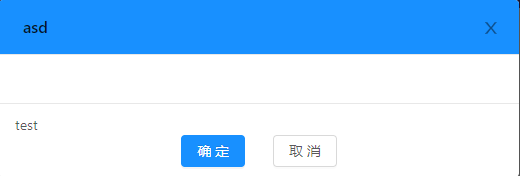
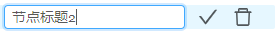

# MinYuanUI

民原科技前端UI库

公司内部的UI

需要大家的**努力**


## 使用说明:

添加依赖:

`npm install minyuanui`

### Modal 模态框

#### 说明:

民原科技的公用模态框,将操作按钮居中,添加模态框的提示功能



#### 声明:

`import {Modal} from 'minyuanui';`

#### API:

| 参数     | 说明                                  | 类型              | 默认值 |
| -------- | ------------------------------------- | ----------------- | ------ |
| btn2     | 第二个按钮是否显示                    | boolean           | true   |
| btn1Name | 按钮1上的文字内容                     | string\|ReactNode | 确定   |
| btn2Name | 按钮2上的文字内容只在btn2为true时有效 | string\|ReactNode | 确定   |
| tips     | 模态框左下角提示内容                  | string\|ReactNode | ''     |
| onOk     | 按钮1回调函数                         | function          |        |
| onCancel | 按钮2回调函数 只在btn2为true时有效    | function          |        |

其他API参考ant design的Modal组件 [传送门](<https://ant-design.gitee.io/components/modal-cn/#API>)

#### Samples:

`
<Modal btn2={false} btn1Name={'btn1name'} tips={'提示内容'}></Modal>
`


### TreeNode 可编辑树节点

#### 说明:

当光标放到树节点上时,显示编辑和删除图标,点击图标时有回调函数

需要设置树节点的属性blockNode设置为true




#### 声明:

`import {EditableTreeNode} from 'minyuanui';`

#### API:

| 参数              | 说明                     | 类型                          | 默认值 |
| ----------------- | ------------------------ | ----------------------------- | ------ |
| handleClickEdit   | 点击编辑按钮时的回调函数 | function(treenode)            |        |
| handleClickDelete | 点击删除按钮时的回调函数 | function(treenode)            |        |
| handleFinishEdit  | 编辑完成后的回调函数     | function(treenode,{newTitle}) |        |
| editable          | 该节点是否能编辑         | boolean                       | false  |
| deletable         | 该节点是否能编辑         | boolean                       | false  |

其他功能: 编辑状态下按回车或者点击勾选图标,可触发编辑完成功能

其他API参考ant design的TreeNode组件 [传送门](<https://ant-design.gitee.io/components/tree-cn/#TreeNode-props>)

#### Samples:

```jsx
<Tree blockNode>
    <EditableTreeNode title={'节点标题2'}
        handleClickEdit={this.test1}
        handleClickDelete={this.test2}
        handleHandleEdit={this.test3}
        editable
        />
</Tree>
```


## 贡献

欢迎PR

## 作者

缪子龙 *其他作者即将出现...*

