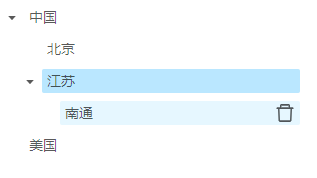
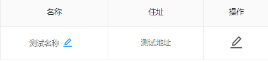
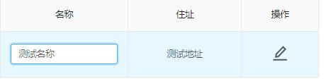
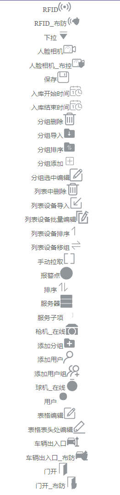
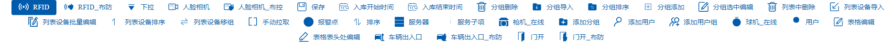

# MinYuanUI

民原科技前端UI库

公司内部的UI

需要大家的**努力**


## 使用说明:

添加依赖:

`npm install minyuanui`

### Modal 模态框

#### 说明:

民原科技的公用模态框,将操作按钮居中,添加模态框的提示功能


#### 声明:

`import {Modal} from 'minyuanui';`

#### API:

| 参数     | 说明                                  | 类型              | 默认值 |
| -------- | ------------------------------------- | ----------------- | ------ |
| btn2     | 第二个按钮是否显示                    | boolean           | true   |
| btn1Name | 按钮1上的文字内容                     | string\|ReactNode | 确定   |
| btn2Name | 按钮2上的文字内容只在btn2为true时有效 | string\|ReactNode | 确定   |
| tips     | 模态框左下角提示内容                  | string\|ReactNode | ''     |
| onOk     | 按钮1回调函数                         | function          |        |
| onCancel | 按钮2回调函数 只在btn2为true时有效    | function          |        |

其他API参考ant design的Modal组件 [传送门](<https://ant-design.gitee.io/components/modal-cn/#API>)

#### Samples:

`
<Modal btn2={false} btn1Name={'btn1name'} tips={'提示内容'}></Modal>
`


### Tree 可编辑树(没有写完,没有测试)

#### 说明:

基于AntDesign设计的功能更强的树,可直接传入数据,不用手动拼接TreeNode节点,每个节点都带有 parent 属性表示父节点,如果 parent 为空表示根节点



#### 声明:

`import {Tree} from 'minyuanui';`

#### API:

| 参数         | 说明     | 类型 | 默认值 |
| ------------ | -------- | ---- | ------ |
| treeNodeData | 节点数据 | json | []     |
|              |          |      |        |
|              |          |      |        |
|              |          |      |        |
|              |          |      |        |

其他API参考ant design的Tree组件 [传送门](<https://ant-design.gitee.io/components/tree-cn/#Tree-props>)

#### Samples:

```jsx
treeNodeData =[
            {
                key: '0', title: '中国', isLeaf: false, children: [
                    {key: '11', title: '北京', editable: true, isLeaf: true},
                    {
                        key: '32', title: '江苏', isLeaf: false, children: [
                            {key: '3206', title: '南通', isLeaf: true, deletable: true}
                        ]
                    }
                ]
            }, {
                key: '1', title: '美国', isLeaf: true
            }
        ]
<Tree blockNode treeNodeData={treeNodeData}/>
```


### TreeNode 可编辑树节点

#### 说明:

当光标放到树节点上时,显示编辑和删除图标,点击图标时有回调函数

需要设置树节点的属性blockNode设置为true


#### 声明:

`import {EditableTreeNode} from 'minyuanui';`

#### API:

| 参数              | 说明                     | 类型                          | 默认值 |
| ----------------- | ------------------------ | ----------------------------- | ------ |
| handleClickEdit   | 点击编辑按钮时的回调函数 | function(treenode)            |        |
| handleClickDelete | 点击删除按钮时的回调函数 | function(treenode)            |        |
| handleFinishEdit  | 编辑完成后的回调函数     | function(treenode,{newTitle}) |        |
| editable          | 该节点是否能编辑         | boolean                       | false  |
| deletable         | 该节点是否能编辑         | boolean                       | false  |

其他功能: 编辑状态下按回车或者点击勾选图标,可触发编辑完成功能

其他API参考ant design的TreeNode组件 [传送门](<https://ant-design.gitee.io/components/tree-cn/#TreeNode-props>)

#### Samples:

```jsx
<Tree blockNode>
    <TreeNode title={'节点标题2'}
        handleClickEdit={this.test1}
        handleClickDelete={this.test2}
        handleHandleEdit={this.test3}
        editable
        />
</Tree>
```


### TableInformation 表格信息框

#### 说明:

用于显示**一行**信息的表格,可在界面上修改部分列数据,修改数据后,需要提交AJAX请求,重新获取数据






#### 声明:

`import {TableInformation} from 'minyuanui';`

#### API:

| 参数           | 说明                                                         | 类型                 | 默认值 | 是否必须 |
| -------------- | ------------------------------------------------------------ | -------------------- | ------ | -------- |
| columns        | 参考AntDesign中Table的[columns](<https://ant-design.gitee.io/components/table-cn/#Table>)对象,增加了editable:true属性,用于表示该列可修改 | array object         | 无     | 是       |
| dataSource     | 参考AntDesign中Table的dataSource对象,目前只支持一行数据      | array object         | 无     | 是       |
| operationTitle | 操作列的标题,如果没有改属性,则不会自动生成操作列             | string\|react node   | 无     | 否       |
| handleSave     | 保存后的回调函数                                             | function(new record) | 无     | 是       |
| handleOperate  | 点击操作按钮之后的回调                                       | function             | 无     | 否       |

其他API参考ant design的Table组件 [传送门](<https://ant-design.gitee.io/components/table-cn/#Table>)

#### Samples:

```jsx
class TableInformationDemo extends React.Component {
    columns = [
        {
            title:'名称',
            dataIndex: 'name',
            key: 'name',
            editable: true,
            width: 200
        },
        {
            title: '住址',
            dataIndex: 'address',
            key: 'address',
        },
    ];
    dataSource = [{
        key: 0,
        name: '测试名称',
        address: '测试地址',
    }]

    handleSave(newRecord,) {
        console.log(newRecord)
    }

    handleOperate = () => {
        console.log('handleOperate')
    }

    render() {
        return (
            <div className={styles.normal}>
                <TableInformation columns={this.columns} operationTitle='操作' handleSave={this.handleSave}
                                  dataSource={this.dataSource} handleOperate={this.handleOperate}
                />
            </div>
        );
    }
}
```

### Icon 图标

#### 说明:

用于显示一个图标,目前图标由**代艺成**设计



光标放到图标上后,会自动变色


#### 声明:

`import {Icon} from 'minyuanui';`

#### API:

| 参数        | 说明                        | 类型                    | 默认值 | 是否必须 |
| ----------- | --------------------------- | ----------------------- | ------ | -------- |
| component   | 图标组件                    | string\|reactnode       | 无     | 否       |
| focuschange | 光标放到图标上之后,是否变色 | boolean\|string\|object | false  | 否       |

component的值清单:

参考示例代码和截图

其他API参考ant design的Icon组件 [传送门](<https://ant-design.gitee.io/components/icon-cn/#API>)

已知bug,focuschange传入boolean值,会报警告 需要时间解决

#### Samples:

```jsx
export default class IconDemo extends React.Component {
    render() {
        return (
            <div>
                <ol>
                    <li>RFID<Icon component='RFID' focuschange='change' style={{fontSize: '2em'}} /></li>
                    <li>RFID_布防<Icon component='RFID_布防' focuschange='change' style={{fontSize: '2em'}} /></li>
                    <li>下拉<Icon component='下拉' focuschange='change' style={{fontSize: '2em'}} /></li>
                    <li>人脸相机<Icon component='人脸相机' focuschange='change' style={{fontSize: '2em'}} /></li>
                    <li>人脸相机_布控<Icon component='人脸相机_布控' focuschange='change' style={{fontSize: '2em'}} /></li>
                    <li>保存<Icon component='保存' focuschange='change' style={{fontSize: '2em'}} /></li>
                    <li>入库开始时间<Icon component='入库开始时间' focuschange='change' style={{fontSize: '2em'}} /></li>
                    <li>入库结束时间<Icon component='入库结束时间' focuschange='change' style={{fontSize: '2em'}} /></li>
                    <li>分组删除<Icon component='分组删除' focuschange='change' style={{fontSize: '2em'}} /></li>
                    <li>分组导入<Icon component='分组导入' focuschange='change' style={{fontSize: '2em'}} /></li>
                    <li>分组排序<Icon component='分组排序' focuschange='change' style={{fontSize: '2em'}} /></li>
                    <li>分组添加<Icon component='分组添加' focuschange='change' style={{fontSize: '2em'}} /></li>
                    <li>分组选中编辑<Icon component='分组选中编辑' focuschange='change' style={{fontSize: '2em'}} /></li>
                    <li>列表中删除<Icon component='列表中删除' focuschange='change' style={{fontSize: '2em'}} /></li>
                    <li>列表设备导入<Icon component='列表设备导入' focuschange='change' style={{fontSize: '2em'}} /></li>
                    <li>列表设备批量编辑<Icon component='列表设备批量编辑' focuschange='change' style={{fontSize: '2em'}} /></li>
                    <li>列表设备排序<Icon component='列表设备排序' focuschange='change' style={{fontSize: '2em'}} /></li>
                    <li>列表设备移组<Icon component='列表设备移组' focuschange='change' style={{fontSize: '2em'}} /></li>
                    <li>手动拉取<Icon component='手动拉取' focuschange='change' style={{fontSize: '2em'}} /></li>
                    <li>报警点<Icon component='报警点' focuschange='change' style={{fontSize: '2em'}} /></li>
                    <li>排序<Icon component='排序' focuschange='change' style={{fontSize: '2em'}} /></li>
                    <li>服务器<Icon component='服务器' focuschange='change' style={{fontSize: '2em'}} /></li>
                    <li>服务子项<Icon component='服务子项' focuschange='change' style={{fontSize: '2em'}} /></li>
                    <li>枪机_在线<Icon component='枪机_在线' focuschange='change' style={{fontSize: '2em'}} /></li>
                    <li>添加分组<Icon component='添加分组' focuschange='change' style={{fontSize: '2em'}} /></li>
                    <li>添加用户<Icon component='添加用户' focuschange='change' style={{fontSize: '2em'}} /></li>
                    <li>添加用户组<Icon component='添加用户组' focuschange='change' style={{fontSize: '2em'}} /></li>
                    <li>球机_在线<Icon component='球机_在线' focuschange='change' style={{fontSize: '2em'}} /></li>
                    <li>用户<Icon component='用户' focuschange='change' style={{fontSize: '2em'}} /></li>
                    <li>表格编辑<Icon component='表格编辑' focuschange='change' style={{fontSize: '2em'}} /></li>
                    <li>表格表头处编辑<Icon component='表格表头处编辑' focuschange='change' style={{fontSize: '2em'}} /></li>
                    <li>车辆出入口<Icon component='车辆出入口' focuschange='change' style={{fontSize: '2em'}} /></li>
                    <li>车辆出入口_布防<Icon component='车辆出入口_布防' focuschange='change' style={{fontSize: '2em'}} /></li>
                    <li>门开<Icon component='门开' focuschange='change' style={{fontSize: '2em'}} /></li>
                    <li>门开_布防<Icon component='门开_布防' focuschange='change' style={{fontSize: '2em'}} /></li>

                </ol>
            </div>
        );
    }
}

```
### Divider 分割线

#### 说明:

用于显示一条水平分割线,样式由**代艺成**设计


文字左侧不再有线,右侧的线为渐变线 线条渐变  #d2dded--#ffffff

#### 声明:

`import {Divider} from 'minyuanui';`

#### API:

没有API

其他API参考ant design的Divider组件 [传送门](<https://ant-design.gitee.io/components/divider-cn/#API>)

#### Samples:

```jsx
export default class IconDemo extends React.Component {
    render() {
        return (
            <div style={{width: 580}}>
                <Divider orientation='left'>文字</Divider>
            </div>
        );
    }
}
```

### Button 按钮

#### 说明:

默认背景透明,悬浮时背景是蓝色的按钮




#### 声明:

`import {Button} from 'minyuanui';`

#### API:

| 参数   | 说明         | 类型              | 默认值 | 是否必须 |
| ------ | ------------ | ----------------- | ------ | -------- |
| icon   | 图标组件     | string\|reactnode | 无     | 是       |
| notext | 是否显示文字 | boolean           | false  | 否       |

其他API参考ant design的Button组件 [传送门](<https://ant-design.gitee.io/components/button-cn/#API>)

#### Samples:

```jsx
export default class ButtonDemo extends React.Component {
    render() {
        return (
            <div>
                <Button icon='RFID' notext={false}>RFID</Button>
                <Button icon='RFID_布防' notext={false}>RFID_布防</Button>
                <Button icon='下拉' notext={false}>下拉</Button>
                <Button icon='人脸相机' notext={false}>人脸相机</Button>
                <Button icon='人脸相机_布控' notext={false}>人脸相机_布控</Button>
                <Button icon='保存' notext={false}>保存</Button>
                <Button icon='入库开始时间' notext={false}>入库开始时间</Button>
                <Button icon='入库结束时间' notext={false}>入库结束时间</Button>
                <Button icon='分组删除' notext={false}>分组删除</Button>
                <Button icon='分组导入' notext={false}>分组导入</Button>
                <Button icon='分组排序' notext={false}>分组排序</Button>
                <Button icon='分组添加' notext={false}>分组添加</Button>
                <Button icon='分组选中编辑' notext={false}>分组选中编辑</Button>
                <Button icon='列表中删除' notext={false}>列表中删除</Button>
                <Button icon='列表设备导入' notext={false}>列表设备导入</Button>
                <Button icon='列表设备批量编辑' notext={false}>列表设备批量编辑</Button>
                <Button icon='列表设备排序' notext={false}>列表设备排序</Button>
                <Button icon='列表设备移组' notext={false}>列表设备移组</Button>
                <Button icon='手动拉取' notext={false}>手动拉取</Button>
                <Button icon='报警点' notext={false}>报警点</Button>
                <Button icon='排序' notext={false}>排序</Button>
                <Button icon='服务器' notext={false}>服务器</Button>
                <Button icon='服务子项' notext={false}>服务子项</Button>
                <Button icon='枪机_在线' notext={false}>枪机_在线</Button>
                <Button icon='添加分组' notext={false}>添加分组</Button>
                <Button icon='添加用户' notext={false}>添加用户</Button>
                <Button icon='添加用户组' notext={false}>添加用户组</Button>
                <Button icon='球机_在线' notext={false}>球机_在线</Button>
                <Button icon='用户' notext={false}>用户</Button>
                <Button icon='表格编辑' notext={false}>表格编辑</Button>
                <Button icon='表格表头处编辑' notext={false}>表格表头处编辑</Button>
                <Button icon='车辆出入口' notext={false}>车辆出入口</Button>
                <Button icon='车辆出入口_布防' notext={false}>车辆出入口_布防</Button>
                <Button icon='门开' notext={false}>门开</Button>
                <Button icon='门开_布防' notext={false}>门开_布防</Button>
            </div>
        );
    }
}

```


## 贡献

欢迎PR

## 作者

缪子龙 *其他作者即将出现...*

